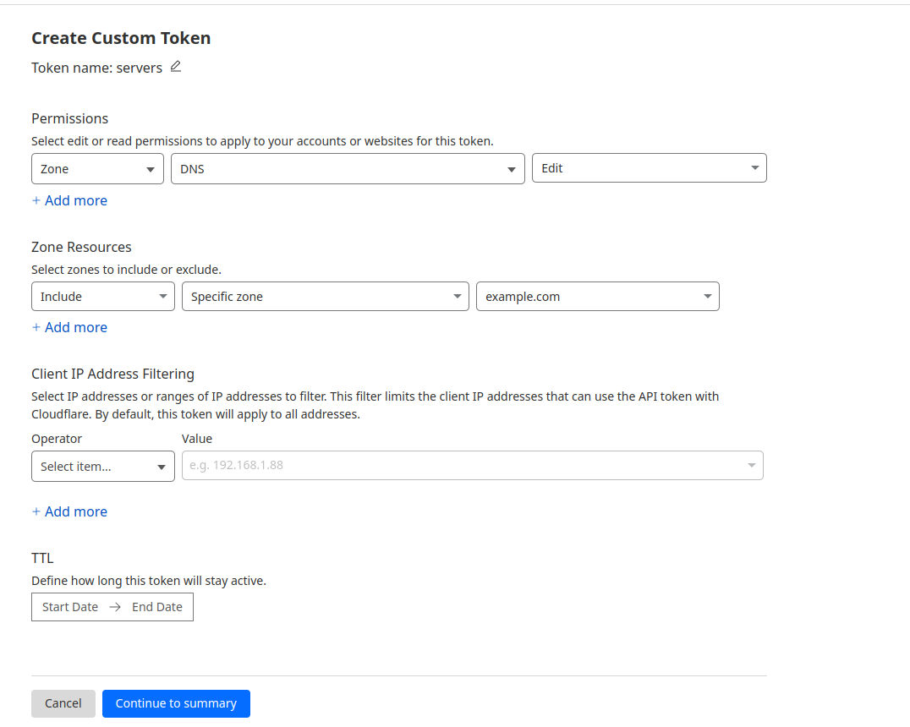

# Setup cert-manager

## Install with HELM

**[Reference](https://cert-manager.io/docs/installation/helm/)**

``` bash
helm repo add jetstack https://charts.jetstack.io --force-update

helm install \
  cert-manager jetstack/cert-manager \
  --namespace cert-manager \
  --create-namespace \
  --version v1.17.0 \
  --set crds.enabled=true
```  


## Create a secret with the CloudFlare API key



``` yaml
apiVersion: v1
kind: Secret
metadata:
  name: cloudflare-api-key-secret
  namespace: cert-manager
type: Opaque
stringData:
  api-key: "<YOUR_CLOUDFLARE_API_KEY>"
```  


