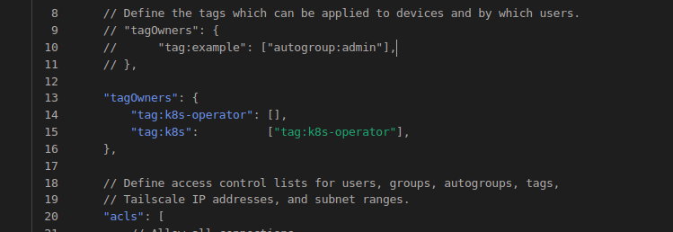
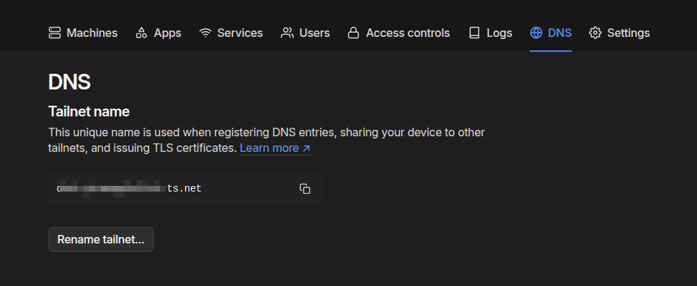
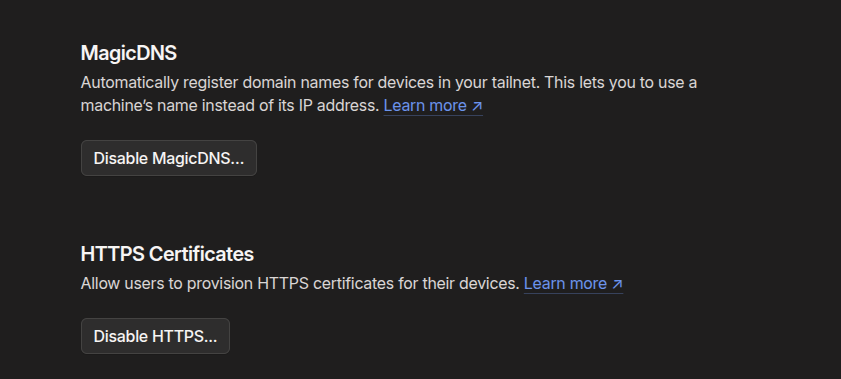
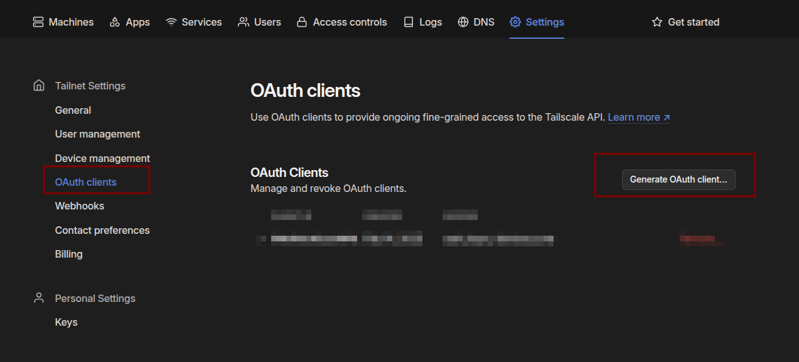

# TailScale Kubernetes installation with Kubernetes operator

Reference: **[Official TasilScale Documentation](https://tailscale.com/kb/1236/kubernetes-operator?q=operator)**


## In TasilScale console:

- Goto "Access Controls"
- Add the following snippets (befiore ```acls``` section) and hit "Save".
``` json
"tagOwners": {
		"tag:k8s-operator": [],
		"tag:k8s":          ["tag:k8s-operator"],
	},
```
  
- Goto ```DNS``` and copy the ```Tailnet name```

- In the ```DNS``` page, also confirm that the ```MagicDNS``` and ```HTTPS Certificates``` are enabled.

- Goto ```Settings``` --> ```OAuth clients``` and generate an OAuth client



## In K8s 

- Add the TailScale helm and Install the chart. Make sure to add the ```OAauth client ID``` and ```OAuth client secret``` obtained from TailScale console ```Settings``` --> ```OAuth clients```
``` bash
helm repo add tailscale https://pkgs.tailscale.com/helmcharts
helm repo update

helm upgrade \
  --install \
  tailscale-operator \
  tailscale/tailscale-operator \
  --namespace=tailscale \
  --create-namespace \
  --set-string oauth.clientId="<OAauth client ID>" \
  --set-string oauth.clientSecret="<OAuth client secret>" \
  --wait
```  
- Expose cluster workloads using a Kubernetes Ingress. Make sure to add the ```Tailnet name``` to the ```hosts``` in the Ingress.

```grafana-ingress-tailscale.yml```

``` yaml
apiVersion: networking.k8s.io/v1
kind: Ingress
metadata:
  name: grafana-tailscale
spec:
  defaultBackend:
    service:
      name: grafana
      port:
        number: 3000
  ingressClassName: tailscale
  tls:
    - hosts:
        - grafana.xxxxxxx.xxxxx.ts.net
```        
- Confirm the Ingress is deplyed.
``` bash
kubectl get ing -A
```